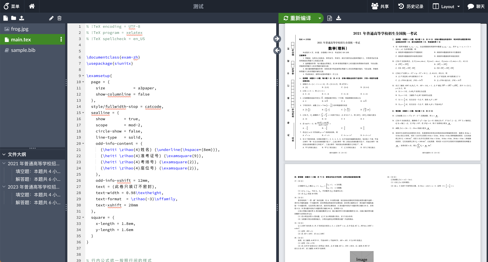

# Overleaf简介

:::note 提示
本文档编写开始于2022年11月2日。经过虚拟机测试、云服务器的安装、TexLive环境配置、XeLatex编译测试、Nginx反向代理配置、证书部署、语言国际化、字体安装配置、配置用户注册、配置单点登录SSO，可以说经过了无数的BUG的折磨最终编写而来这个文档。希望给需要用到自己部署的人！
:::
:::info 说明
网上的教程非常多，但内容无一齐全，例如很多教程没涉及语言环境变量配置，基本没有任何介绍XeLatex编译引擎的配置，官方教程（英文版）乃至到网络上的各种文档中提到的一些问题也没有讲到核心点上，基本就是给出命令，照搬执行。很多问题都是查了很多issue才解决的。所以我编写了这个文档，希望有需要的人能够用到！
:::
:::caution 警告
友情提醒（面向开发人员）：请务必在配置好容器环境变量后再拉起容器，然后修改容器内容。否则一旦出现环境变量缺失，或者环境变量错误需要修改的，都需要销毁容器后重新创建新容器。也就是说，一旦需要修改容器环境变量，您对该容器文件内容的修改将会全部作废！
:::
:::note 鸣谢
特别鸣谢：https://sparktour.me 博客中提到的相关教程！为单点登录的实现提供了参考。基于此修改后的Overleaf命名为Overleaf Plus，代码全开源。请参考：[GitHub Overleaf Plus](https://github.com/Musicminion/overleaf)
:::

## 1）功能简介
在正式开始之前，请允许我介绍一下Overleaf。Overleaf是一款开源的Latex在线编辑软件，通过云端集成Latex环境， 实现用户在浏览器中打开就可以进行Latex内容的在线编辑、预览。Overleaf最大的优点是云端集成Latex的环境、以及 容器化的部署方案。能够轻松的实现跨平台使用。只要你部署成功，你可以在你的iPad、Android手机/平板、iPhone手机、Mac电脑、Windows电脑，乃至任何一个拥有浏览器的Linux操作系统上。此外，你还可以把自己的镜像分享给他人， 或者在自己的另外一台服务器上使用。

当然，为了保证数据安全，你也可以在企业（例如学校/科研机构）的内网部署。例如，在需要进行协作编辑的场景（如下图所示 ，编辑考试试卷），内网部署既增加了数据的安全性，也保证了访问的便捷性。本文还包括了单点登录的集成，便于Overleaf能够对接企业级身份认证系统。

## 2）功能简介
Overleaf有多个版本，具体介绍如下：
- Overleaf社区版：Github开源，免费，私有化部署，适合学校、小型企业自己内网部署、使用。
- Overleaf专业版：收费，通过密钥才能下载Docker镜像，需要购买（但是一般发邮件咨询价格，Overleaf会强烈推荐使用他的公有云版）产品适用于企业级别，集成了单点登录、用户管理等功能。
- Overleaf公有云版：普通用户之间打开官网即可使用！部分功能需要订阅，价格89美元一年，基本大多数人不会考虑订阅。地址链接：[Overleaf中国站](https://cn.overleaf.com/)

## 3）部署类型
本文档介绍3种类型的部署：个人级部署、团队级部署、企业级部署。您可以根据你的使用需要、使用场景。
- **个人级部署**：在个人的电脑上部署Overleaf，之后只需要在浏览器中打开，就可以使用Overleaf。你只需要拥有一台电脑即可（Windows /Mac Intel /Mac M1或M2 /Linux均支持）。
- **团队级部署**：在局域网、或者公网的服务器上部署，之后局域网用户只需要在浏览器中打开即可协同编辑、使用Overleaf。例如某些实验室，或者在数学建模比赛中，你需要和团队协作编辑Latex文档。
- **企业级部署**：在企业的局域网、或者公网的服务器上部署，并对接企业的统一身份认证系统。用户可以通过您企业或者第三方认证系统，完成登陆。你也可以限制只有你企业的用户才可以使用你的Overleaf。例如给学校部署Overleaf。

## 3）可能的问题
1. **我没有任何服务器部署或者运维的经验，是否可以部署？**

    **回答：**可以！本教程尽可能的保证详细准确，毕竟很多人都是从0基础开始学习的，所以欢迎挑战！个人级部署不会涉及到很多专业知识，会尽可能的详细。
    而团队级部署和企业级部署面向专业的开发人员。如果你不了解Linux，但是想要尝试Linux部署，可能需要在虚拟机图形化的页面“体验”一段时间，
    再进行上云服务器的操作。

2. **我的电脑是M1芯片的Mac电脑，是否可以用？或者我的服务器CPU架构是Arm是否可部署？**

    **回答：**可以！根据官方解释，Arm架构的Overleaf的镜像可以自行构建，你也可以使用我已经构建好了的镜像。如果你没有使用过docker请遵循我的教程。

