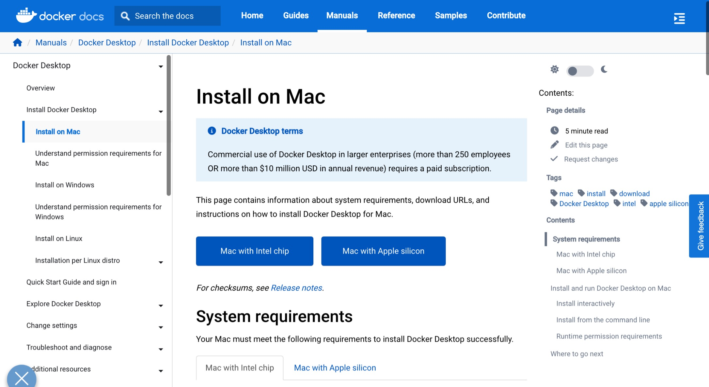

# macOS-Arm部署
:::caution 警告
「macOS-Intel部署」适用于arm64架构的M1/M2 Mac。在运行macOS的macbook、macMini、iMac、Mac Studio、Mac Pro等上部署。请在部署前确认您的macOS的CPU为**M1/M2或更新**的CPU，而**不是Intel较老的芯片**。然后在继续进行按照本部分部署。
:::

## 确认CPU架构
通常来说，如果您的mac电脑是Intel系列芯片的CPU，请前往[macOS-Intel部署](./2-macOS-Intel部署.md)，反之如果您的mac电脑是2020之后的购买的，且是m系列芯片的，您可以继续阅读本部分内容。

如果您仍然不放心，您可以打开macOS 终端输入`arch`，如果显示的是`arm64`，那么您才可以继续阅读本教程。
```shell title="macOS 终端"
mac-user@mac-studio:~$ arch
arm64
```

## 安装docker
请打开链接，[Docker desktop for Mac](https://docs.docker.com/desktop/install/mac-install/)，并选择下载项：**mac with Apple silicon**



