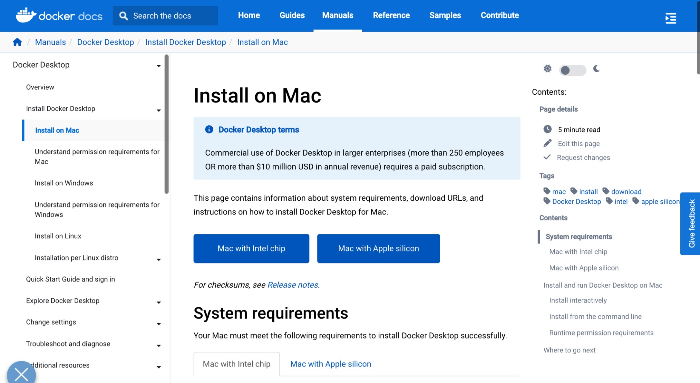
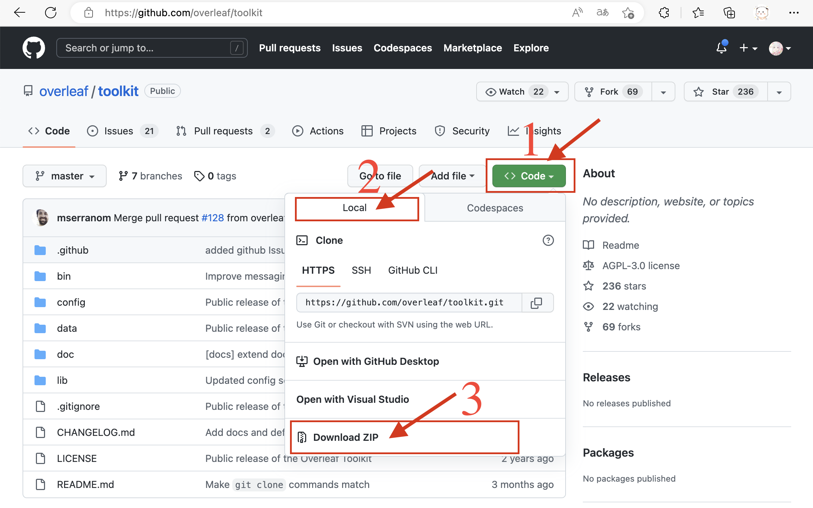
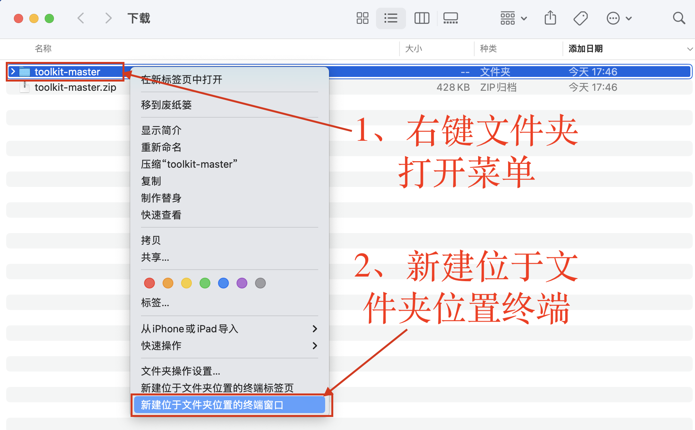

# macOS-Arm部署

```mdx-code-block
import Tabs from '@theme/Tabs';
import TabItem from '@theme/TabItem';
```

:::caution 警告
「macOS-Intel部署」适用于arm64架构的M1/M2 Mac。在运行macOS的macbook、macMini、iMac、Mac Studio、Mac Pro等上部署。请在部署前确认您的macOS的CPU为**M1/M2或更新版本**的CPU，而**不是Intel较老的芯片**。然后在继续进行按照本部分部署。
:::

## 确认CPU架构
通常来说，如果您的mac电脑是Intel系列芯片的CPU，请前往[macOS-Intel部署](./2-macOS-Intel部署.md)，反之如果您的mac电脑是2020之后的购买的，且是M系列芯片的，您可以继续阅读本部分内容。

如果您仍然不放心，您可以打开macOS 终端输入`arch`，如果显示的是`arm64`，那么您才可以继续阅读本教程。
```shell title="macOS 终端"
mac-user@mac-studio:~$ arch
arm64
```

## 安装docker
请打开链接，[Docker desktop for Mac](https://docs.docker.com/desktop/install/mac-install/)，并选择下载项：**mac with Apple silicon**，下载完成后按照正常的流程安装即可。


安装完成后，请打开MacOS的终端（快捷键Command+空格，然后文字输入终端也可以打开），然后输入`docker -v`并回车，如果您可以看到输出的版本号（并不需要完全一致），说明安装完成。
```shell title="macOS 终端"
# 输入docker -v 检查docker是否安装完成
user@Mac-Studio ~ % docker -v
Docker version 20.10.22, build 3a2c30b
# 当然你也可以再输入docker-compose -v，检查docker-compose是否安装完成
user@Mac-Studio ~ % docker -v
Docker Compose version v2.15.1
```

## 安装Git
您可以打开MacOS的终端（快捷键Command+空格，然后文字输入终端也可以打开），然后输入`git`并回车，如果您之前没有安装过Xcode或者开发人员工具，此时系统会有提示框建议你下载。或者您也可以直接到AppStore下载Xcode即可。

如果您回车后没有提示，或者出现下面所示的输出（仅展示前几行），说明您已经安装好了Git。
```shell title="macOS 终端"
user@Mac-Studio ~ % git
usage: git [-v | --version] [-h | --help] [-C <path>] [-c <name>=<value>]
           [--exec-path[=<path>]] [--html-path] [--man-path] [--info-path]
           [-p | --paginate | -P | --no-pager] [--no-replace-objects] [--bare]
           [--git-dir=<path>] [--work-tree=<path>] [--namespace=<name>]
           [--super-prefix=<path>] [--config-env=<name>=<envvar>]
           <command> [<args>]
```

## 下载Overleaf工具箱

接下来我们需要下载[Overleaf官方工具箱](https://github.com/overleaf/toolkit)，这个工具箱将会为我们提供快捷的管理本地Overleaf的命令，例如常见的启动和关闭，具体说来如下：
- 一键启动Overleaf脚本(拉起所有Overleaf的容器)
- 一键关闭Overleaf脚本(关闭所有Overleaf的容器)
- 一键诊断Overleaf脚本(检查Bug问题)
- 一键连接Overleaf的MongoDB数据库(开发人员工具)
- 其他实用工具

:::tip 友情提示
由于在国内存在网络限制，您可以需要一些额外的代理工具才能成功访问：[Github网站](https://github.com)。请当您能够在浏览器中打开 `https://github.com` 时，再继续后面的步骤。
:::

我们这里给出两种方法，如果你更熟悉命令行，请使用第一种方法，如果你刚刚在安装Git的时候出现了一些问题，请使用方法二。
```mdx-code-block
<Tabs>
<TabItem value="方法一：通过git命令下载">
```
您可以打开MacOS的终端（快捷键<kbd>Command</kbd>+<kbd>空格</kbd>，然后文字输入 `终端` 即可打开），然后输入下面的命令后回车。这个命令会从Github的远程仓库拉取文件，存放到当前目录下的 `overleaf-toolkit` 文件夹下。

如果你不知道当前目录是什么，你可以在终端中输入 `pwd` 然后回车，他会告诉你当前的路径是什么。通常来说如果你直接打开终端，默认的路径是`/Users/[yourUsername]`，这也是你的家目录，或者说home目录。
```shell title="MacOS终端 克隆仓库"
# 下载速度因网络而异，如果长时间卡死请检查你的网络是否可以访问 Github
git clone https://github.com/overleaf/toolkit.git ./overleaf-toolkit
# 下载完成后请不要退出终端
```

```shell title="MacOS终端 获取当前工作路径"
user@Mac-Studio ~ % pwd
# 输出部分的******就是你的用户名，这里省略
/Users/******
```
这样下载完成后，你将会在你Mac电脑的 `/Users/[yourUsername]/` 下面看到overleaf-toolkit文件夹。你可以在访达中打开检查一下。

```mdx-code-block
</TabItem>
<TabItem value="方法二：通过浏览器下载">
```
请在浏览器中打开：[Overleaf-Tools-官方地址](https://github.com/overleaf/toolkit)，然后按照下图所示的方式，下载zip文件夹


```mdx-code-block
</TabItem>
</Tabs>
```

## 切换到工具箱目录
:::tip 友情提示
在这一步我们要把我们的终端的工作目录，切换到我们刚刚下载的工具箱文件夹下面。请选择和您刚刚下载Overleaf工具箱一致的方法。
:::


```mdx-code-block
<Tabs>
<TabItem value="1、上一步是通过git命令下载">
```
:::tip 友情提示
这里要介绍一个命令 `cd`，它的全称是`change directory`，也就是改变当前工作目录。假设你当前工作目录下有一个文件夹名称叫做`folder1`，那么通过输入命令`cd folder1`后回车，你就可以进入到`folder1`的文件夹下。
:::
请在终端中继续输入：`cd overleaf-toolkit` 然后回车。产生的效果应该如下面高亮部分的代码所示。
```shell title="MacOS终端 切换到overleaf-tool目录"
user@Mac-Studio ~ % git clone https://github.com/overleaf/toolkit.git ./overleaf-toolkit
Cloning into './overleaf-toolkit'...
remote: Enumerating objects: 1401, done.
remote: Counting objects: 100% (332/332), done.
remote: Compressing objects: 100% (129/129), done.
remote: Total 1401 (delta 249), reused 240 (delta 197), pack-reused 1069
Receiving objects: 100% (1401/1401), 610.05 KiB | 920.00 KiB/s, done.
Resolving deltas: 100% (907/907), done.
// highlight-start
user@Mac-Studio ~ % cd overleaf-toolkit
user@Mac-Studio overleaf-toolkit %
// highlight-end
```

```mdx-code-block
</TabItem>
<TabItem value="2、上一步是通过浏览器下载">
```
如果你上一步是通过浏览器下载的，请先双击下载的zip文件，MacOS会自动解压，并创建一个名字叫做toolkit-master的文件夹。然后如下图所示，打开终端，该终端的工作目录就是我们刚刚下载的Overleaf工具箱目录。


```mdx-code-block
</TabItem>
</Tabs>
```

## 修改镜像源为Arm64的镜像
由于你的mac是Arm架构的CPU，官方尚未发布Arm的镜像，但是给出了自行构建的方法，我这里已经构建了最新的镜像，上传到了[DockerHub](https://hub.docker.com/repository/docker/musicminion/sharelatex_arm64/general)：如果你感兴趣的话可以前往查看。

现在请在访达中打开你刚刚下载的overleaf工具箱文件夹，找到 `lib/docker-compose.base.yml` 用任何一个文本编辑器打开，然后做下面的修改。（当然如果你担心之后会有更新版本的Overleaf发布，你想要获取更新，同样请前往[DockerHub](https://hub.docker.com/repository/docker/musicminion/sharelatex_arm64/general)检查最新的版本，并讲下面3.4的版本做出对应的修改。）

```mdx-code-block
<Tabs>
<TabItem value="修改前的lib/docker-compose.base.yml">
```
```yaml
---
version: '2.2'
services:

    sharelatex:
        restart: always
        image: "${IMAGE}"
        container_name: sharelatex
        volumes:
            - "${SHARELATEX_DATA_PATH}:/var/lib/sharelatex"
        ports:
            - "${SHARELATEX_LISTEN_IP:-127.0.0.1}:${SHARELATEX_PORT:-80}:80"
        environment:
          SHARELATEX_MONGO_URL: "${MONGO_URL}"
          SHARELATEX_REDIS_HOST: "${REDIS_HOST}"
          REDIS_HOST: "${REDIS_HOST}"
        env_file: ../config/variables.env
```


```mdx-code-block
</TabItem>
<TabItem value="修改后的lib/docker-compose.base.yml">
```
```yaml
---
version: '2.2'
services:

    sharelatex:
        restart: always
        # highlight-start
        image: "musicminon/sharelatex:3.4"
        # highlight-end
        container_name: sharelatex
        volumes:
            - "${SHARELATEX_DATA_PATH}:/var/lib/sharelatex"
        ports:
            - "${SHARELATEX_LISTEN_IP:-127.0.0.1}:${SHARELATEX_PORT:-80}:80"
        environment:
          SHARELATEX_MONGO_URL: "${MONGO_URL}"
          SHARELATEX_REDIS_HOST: "${REDIS_HOST}"
          REDIS_HOST: "${REDIS_HOST}"
        env_file: ../config/variables.env
```

```mdx-code-block
</TabItem>
</Tabs>
```

:::info
如果你不想使用我构建的镜像，你想要自己构建镜像，请参考本章节的：[构建自己的镜像](./7-构建自己的镜像.md)，该教程会引导你从头开始，从源代码构建相关的镜像。
:::

## 初始化配置文件
在《切换到工具箱目录》这一部分我们打开的终端中，输入 `sudo bin/init` 然后回车。系统会提示你输入管理员密码，这个密码就是你登陆Mac的密码(**不是AppleID密码**)，在输入过程中终端**不会有任何提示**，输入完成后自行回车即可。效果如下图
```shell title="MacOS终端 初始化配置"
user@Mac-Studio overleaf-toolkit % sudo bin/init
Password:
Copying config files to 'config/'
```
然后由于Mac似乎在创建文件夹上存在一些问题，需要你依次手动输入：
- 输入 `mkdir data/sharelatex` 后回车
- 输入 `mkdir data/mongo` 后回车
- 输入 `mkdir data/redis` 后回车
效果如下所示
```shell title="MacOS终端 创建容器数据挂载文件夹"
user@Mac-Studio overleaf-toolkit % mkdir data/sharelatex
user@Mac-Studio overleaf-toolkit % mkdir data/mongo
user@Mac-Studio overleaf-toolkit % mkdir data/redis
```

## 编辑配置文件
接下来请打开你的Overleaf-Tool工具箱文件夹下面 `config/overleaf.rc`，按照下面所示的修改（你可以选择你喜欢的文本编辑器工具，无论是命令行工具还是系统自带的编辑器）：

```mdx-code-block
<Tabs>
<TabItem value="修改前的config/overleaf.rc">
```
```shell showLineNumbers
#### Overleaf RC ####

PROJECT_NAME=overleaf

# Sharelatex container
SHARELATEX_DATA_PATH=data/sharelatex
SERVER_PRO=false
SHARELATEX_LISTEN_IP=127.0.0.1
SHARELATEX_PORT=80

# Sibling Containers
SIBLING_CONTAINERS_ENABLED=false
DOCKER_SOCKET_PATH=/var/run/docker.sock

# Mongo configuration
MONGO_ENABLED=true
MONGO_DATA_PATH=data/mongo
MONGO_IMAGE=mongo:4.4

# Redis configuration
REDIS_ENABLED=true
REDIS_DATA_PATH=data/redis

# TLS proxy configuration (optional)
# See documentation in doc/tls-proxy.md
NGINX_ENABLED=false
NGINX_CONFIG_PATH=config/nginx/nginx.conf
NGINX_HTTP_PORT=80
# Replace these IP addresses with the external IP address of your host
NGINX_HTTP_LISTEN_IP=127.0.1.1
NGINX_TLS_LISTEN_IP=127.0.1.1
TLS_PRIVATE_KEY_PATH=config/nginx/certs/overleaf_key.pem
TLS_CERTIFICATE_PATH=config/nginx/certs/overleaf_certificate.pem
TLS_PORT=443
```


```mdx-code-block
</TabItem>
<TabItem value="修改后的config/overleaf.rc">
```
```shell  showLineNumbers
#### Overleaf RC ####

PROJECT_NAME=overleaf

# Sharelatex container
SHARELATEX_DATA_PATH=data/sharelatex
SERVER_PRO=false
# highlight-start
SHARELATEX_LISTEN_IP=0.0.0.0 # 如果你要让局域网的电脑访问，请修改为0.0.0.0
SHARELATEX_PORT=3000         # 建议修改为3000，避免常见端口被占用
# highlight-end

# Sibling Containers
SIBLING_CONTAINERS_ENABLED=false
DOCKER_SOCKET_PATH=/var/run/docker.sock

# Mongo configuration
MONGO_ENABLED=true
MONGO_DATA_PATH=data/mongo
MONGO_IMAGE=mongo:4.4

# Redis configuration
REDIS_ENABLED=true
REDIS_DATA_PATH=data/redis

# TLS proxy configuration (optional)
# See documentation in doc/tls-proxy.md
NGINX_ENABLED=false
NGINX_CONFIG_PATH=config/nginx/nginx.conf
NGINX_HTTP_PORT=80
# Replace these IP addresses with the external IP address of your host
NGINX_HTTP_LISTEN_IP=127.0.1.1
NGINX_TLS_LISTEN_IP=127.0.1.1
TLS_PRIVATE_KEY_PATH=config/nginx/certs/overleaf_key.pem
TLS_CERTIFICATE_PATH=config/nginx/certs/overleaf_certificate.pem
TLS_PORT=443
```

```mdx-code-block
</TabItem>
</Tabs>
```

## 编辑环境变量文件
:::info 提示
`.env` 文件存储的是环境变量文件，文件中一般都是以行为单位，等号`=`左边是环境变量的名称，等号右边是环境变量的值。环境变量通常是用来存储一些比较敏感的数据，例如：连接数据库的密码。通过环境变量存储密码，就避免了在代码中明文编码这些敏感信息，所以是值得推荐的方式。此外通过环境变量，我们可以在容器外配置好这些值，而不需要进入容器内部修改，这也是Overleaf使用环境变量的原因。
:::

接下来请打开你的Overleaf-Tool工具箱文件夹下面 `config/variables.env`，按照下面所示的修改（你可以选择你喜欢的文本编辑器工具，无论是命令行工具还是系统自带的编辑器）：

```mdx-code-block
<Tabs>
<TabItem value="修改前的config/variables.env">
```
```shell showLineNumbers
SHARELATEX_APP_NAME=Our Overleaf Instance

ENABLED_LINKED_FILE_TYPES=project_file,project_output_file

# Enables Thumbnail generation using ImageMagick
ENABLE_CONVERSIONS=true

# Disables email confirmation requirement
EMAIL_CONFIRMATION_DISABLED=true

# temporary fix for LuaLaTex compiles
# see https://github.com/overleaf/overleaf/issues/695
TEXMFVAR=/var/lib/sharelatex/tmp/texmf-var

## Nginx
# NGINX_WORKER_PROCESSES=4
# NGINX_WORKER_CONNECTIONS=768

## Set for TLS via nginx-proxy
# SHARELATEX_BEHIND_PROXY=true
# SHARELATEX_SECURE_COOKIE=true

# SHARELATEX_SITE_URL=http://overleaf.example.com
# SHARELATEX_NAV_TITLE=Our Overleaf Instance
# SHARELATEX_HEADER_IMAGE_URL=http://somewhere.com/mylogo.png
# SHARELATEX_ADMIN_EMAIL=support@example.com

# SHARELATEX_LEFT_FOOTER=[{"text":"Powered by Overleaf © 2021", "url": "https://www.overleaf.com"}, {"text": "Contact your support team", "url": "mailto:support@example.com"} ]
# SHARELATEX_RIGHT_FOOTER=[{"text":"Hello I am on the Right"}]

# SHARELATEX_EMAIL_FROM_ADDRESS=team@example.com

# SHARELATEX_EMAIL_AWS_SES_ACCESS_KEY_ID=
# SHARELATEX_EMAIL_AWS_SES_SECRET_KEY=

# SHARELATEX_EMAIL_SMTP_HOST=smtp.example.com
# SHARELATEX_EMAIL_SMTP_PORT=587
# SHARELATEX_EMAIL_SMTP_SECURE=false
# SHARELATEX_EMAIL_SMTP_USER=
# SHARELATEX_EMAIL_SMTP_PASS=
# SHARELATEX_EMAIL_SMTP_NAME=
# SHARELATEX_EMAIL_SMTP_LOGGER=false
# SHARELATEX_EMAIL_SMTP_TLS_REJECT_UNAUTH=true
# SHARELATEX_EMAIL_SMTP_IGNORE_TLS=false
# SHARELATEX_CUSTOM_EMAIL_FOOTER=This system is run by department x

################
## Server Pro ##
################

EXTERNAL_AUTH=none
# SHARELATEX_LDAP_URL=ldap://ldap:389
# SHARELATEX_LDAP_SEARCH_BASE=ou=people,dc=planetexpress,dc=com
# SHARELATEX_LDAP_SEARCH_FILTER=(uid={{username}})
# SHARELATEX_LDAP_BIND_DN=cn=admin,dc=planetexpress,dc=com
# SHARELATEX_LDAP_BIND_CREDENTIALS=GoodNewsEveryone
# SHARELATEX_LDAP_EMAIL_ATT=mail
# SHARELATEX_LDAP_NAME_ATT=cn
# SHARELATEX_LDAP_LAST_NAME_ATT=sn
# SHARELATEX_LDAP_UPDATE_USER_DETAILS_ON_LOGIN=true

# SHARELATEX_TEMPLATES_USER_ID=578773160210479700917ee5
# SHARELATEX_NEW_PROJECT_TEMPLATE_LINKS=[{"name":"All Templates","url":"/templates/all"}]

# TEX_LIVE_DOCKER_IMAGE=quay.io/sharelatex/texlive-full:2022.1
# ALL_TEX_LIVE_DOCKER_IMAGES=quay.io/sharelatex/texlive-full:2022.1,quay.io/sharelatex/texlive-full:2021.1,quay.io/sharelatex/texlive-full:2020.1

# SHARELATEX_PROXY_LEARN=true

```


```mdx-code-block
</TabItem>
<TabItem value="修改后的config/variables.env">
```
```shell  showLineNumbers
# highlight-start
# SHARELATEX_APP_NAME 就是你网站首页的标题，可以根据需要修改
SHARELATEX_APP_NAME=我的Overleaf
# highlight-end

# highlight-start
# 这个SHARELATEX_SITE_LANGUAGE 是网站的语言配置选项，一般请改成中文
SHARELATEX_SITE_LANGUAGE=zh-CN
# highlight-end


ENABLED_LINKED_FILE_TYPES=project_file,project_output_file

# Enables Thumbnail generation using ImageMagick
ENABLE_CONVERSIONS=true

# Disables email confirmation requirement
EMAIL_CONFIRMATION_DISABLED=true

# temporary fix for LuaLaTex compiles
# see https://github.com/overleaf/overleaf/issues/695
TEXMFVAR=/var/lib/sharelatex/tmp/texmf-var

## Nginx
# NGINX_WORKER_PROCESSES=4
# NGINX_WORKER_CONNECTIONS=768

## Set for TLS via nginx-proxy
# SHARELATEX_BEHIND_PROXY=true
# SHARELATEX_SECURE_COOKIE=true

# SHARELATEX_SITE_URL=http://overleaf.example.com
# SHARELATEX_NAV_TITLE=Our Overleaf Instance
# SHARELATEX_HEADER_IMAGE_URL=http://somewhere.com/mylogo.png
# SHARELATEX_ADMIN_EMAIL=support@example.com

# SHARELATEX_LEFT_FOOTER=[{"text":"Powered by Overleaf © 2021", "url": "https://www.overleaf.com"}, {"text": "Contact your support team", "url": "mailto:support@example.com"} ]
# SHARELATEX_RIGHT_FOOTER=[{"text":"Hello I am on the Right"}]

# SHARELATEX_EMAIL_FROM_ADDRESS=team@example.com

# SHARELATEX_EMAIL_AWS_SES_ACCESS_KEY_ID=
# SHARELATEX_EMAIL_AWS_SES_SECRET_KEY=

# SHARELATEX_EMAIL_SMTP_HOST=smtp.example.com
# SHARELATEX_EMAIL_SMTP_PORT=587
# SHARELATEX_EMAIL_SMTP_SECURE=false
# SHARELATEX_EMAIL_SMTP_USER=
# SHARELATEX_EMAIL_SMTP_PASS=
# SHARELATEX_EMAIL_SMTP_NAME=
# SHARELATEX_EMAIL_SMTP_LOGGER=false
# SHARELATEX_EMAIL_SMTP_TLS_REJECT_UNAUTH=true
# SHARELATEX_EMAIL_SMTP_IGNORE_TLS=false
# SHARELATEX_CUSTOM_EMAIL_FOOTER=This system is run by department x

################
## Server Pro ##
################

EXTERNAL_AUTH=none
# SHARELATEX_LDAP_URL=ldap://ldap:389
# SHARELATEX_LDAP_SEARCH_BASE=ou=people,dc=planetexpress,dc=com
# SHARELATEX_LDAP_SEARCH_FILTER=(uid={{username}})
# SHARELATEX_LDAP_BIND_DN=cn=admin,dc=planetexpress,dc=com
# SHARELATEX_LDAP_BIND_CREDENTIALS=GoodNewsEveryone
# SHARELATEX_LDAP_EMAIL_ATT=mail
# SHARELATEX_LDAP_NAME_ATT=cn
# SHARELATEX_LDAP_LAST_NAME_ATT=sn
# SHARELATEX_LDAP_UPDATE_USER_DETAILS_ON_LOGIN=true

# SHARELATEX_TEMPLATES_USER_ID=578773160210479700917ee5
# SHARELATEX_NEW_PROJECT_TEMPLATE_LINKS=[{"name":"All Templates","url":"/templates/all"}]

# TEX_LIVE_DOCKER_IMAGE=quay.io/sharelatex/texlive-full:2022.1
# ALL_TEX_LIVE_DOCKER_IMAGES=quay.io/sharelatex/texlive-full:2022.1,quay.io/sharelatex/texlive-full:2021.1,quay.io/sharelatex/texlive-full:2020.1

# SHARELATEX_PROXY_LEARN=true

```

```mdx-code-block
</TabItem>
</Tabs>
```