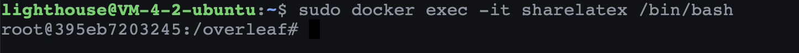

# TexLive宏包的安装

```mdx-code-block
import Tabs from '@theme/Tabs';
import TabItem from '@theme/TabItem';
```

:::caution 警告
无论你是采用「个人级部署」中的哪一种方式部署的，你都需要安装Tex Live相关的宏包，才可以正常使用你的Overleaf。如果你发现下面的问题，**都是因为没有安装TexLive**
- 发现你的Overleaf不支持中文
- 无法编译某些tex文档，报错提示找不到某些包
- Xelatex不支持编译，无法使用Xelatex
:::

## 查看正在运行的容器
首先你需要确保你的Overleaf已经成功部署并开始运行，查看正在运行着的容器，确保你的overleaf相关的容器正在运行。在你的电脑上打开命令行终端，输入下面的命令
```shell
sudo docker ps
```

如果你在输出的文字中，看到了`sharelatex`的字样，说明你已经部署成功了。
```shell
admin@cloudOS ~ % sudo docker ps
CONTAINER ID   IMAGE                         COMMAND                  CREATED          STATUS                    PORTS                                                             NAMES
e6f9ecbd6d6f   sharelatex/sharelatex:3.3.0   "/sbin/my_init"          31 minutes ago   Up 28 minutes             0.0.0.0:3000->80/tcp, 0.0.0.0:4000->1234/tcp, :::4000->1234/tcp   e6f9ecbd6d6f_sharelatex
9056493d1864   redis:5.0                     "docker-entrypoint.s…"   31 minutes ago   Up 28 minutes             6379/tcp                                                          redis
07c2c673078b   mongo:4.4                     "docker-entrypoint.s…"   31 minutes ago   Up 28 minutes (healthy)   27017/tcp                                                         mongo
```


## 进入Sharelatex容器
接下来，我们需要让命令行进入到docker的环境中，具体来说有两种方法进入容器。

```mdx-code-block
<Tabs>
<TabItem value="通过Name进入容器">
```
:::info 提示
name是容器的名字，可以通过name进入容器，如果发现此方法失效，你可以尝试通过ID进入容器。执行下面的语句，指定name为`sharelatex`的容器进入。
:::info 提示
```shell
sudo docker exec -it sharelatex /bin/bash
```

如果进入成功，你将看到如下如所示的结果。



```mdx-code-block
</TabItem>
<TabItem value="通过ID进入容器">
```

:::info 提示
ID是每个容器的唯一标识符，我们上面[查看正在运行的容器](#查看正在运行的容器)已经介绍到`docker ps`的命令，我们需要找到`IMAGE`中出现`sharelatex`的`CONTAINER ID`才可以。在我上面的例子中，是`e6f9ecbd6d6f`
:::

```shell
sudo docker exec -it e6f9ecbd6d6f /bin/bash
```

```mdx-code-block
</TabItem>
</Tabs>
```


## 指定下载地址
由于TexLive的宏包非常的大，完整版本大概在4GB以上，所以为了提高下载速度，你需要指定最近的下载服务器。
```shell
# 根据你的地理位置 选择，我这里是因为服务器在上海，就选择了交大的服务器
tlmgr option repository https://cran.asia/tex/systems/texlive/tlnet/
```

当然，如果你觉得速度太慢，请前往：[下载LexLive](https://www.ctan.org/mirrors) 获取全球各地的TexLive下载地址，我这里列举几个常见的，你只需要把下载地址替换一下即可：
- 香港：`https://mirror-hk.koddos.net/CTAN/systems/texlive/tlnet/`
- 阿里云：`https://mirrors.aliyun.com/CTAN/systems/texlive/tlnet/`
- 腾讯云：`https://mirrors.cloud.tencent.com/CTAN/systems/texlive/tlnet/`
- 上海：`https://mirrors.sjtug.sjtu.edu.cn/ctan/systems/texlive/tlnet/`
- 亚洲：`https://cran.asia/tex/systems/texlive/tlnet/`

## 开始下载
依次执行下面的语句即可！这个步骤要的时间因网络、计算机性能而异。下载快的话大概需要16-20分钟的时间，慢的话甚至超过一个小时。安装的过程因机器而异。
```
tlmgr option repository https://mirrors.huaweicloud.com/CTAN/systems/texlive/
tlmgr update --self --all
tlmgr install scheme-full &
```