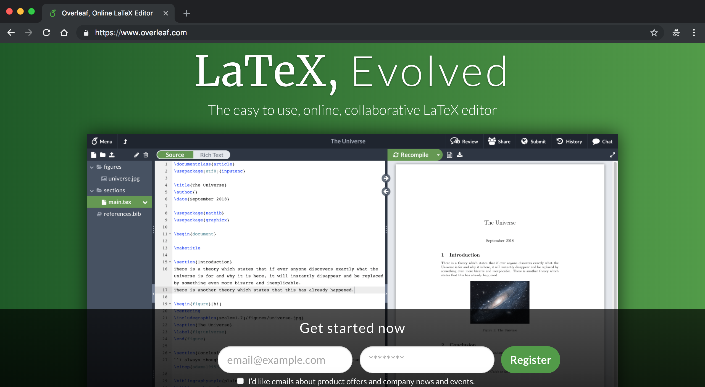

# 创建文档

```mdx-code-block
import Tabs from '@theme/Tabs';
import TabItem from '@theme/TabItem';
```


## 内容
- 创建账户
- 创建新的项目
- 快速指南
- 探索阅读

## 创建账户
Overleaf是一个很方便的在线LaTeX编辑工具，允许您直接在Web浏览器中创建LaTeX文档。本文介绍了如何在Overleaf中创建新项目，可以从头开始，上传自己的文件，也可以使用众多可用模板之一。


:::info
如果您是管理员，想要把自己的Overleaf升级到支持用户注册，或者配置仅仅允许特定域名后缀邮箱注册，或者和企业的SSO身份系统对接，请参考Wiki中[Overleaf部署教程](/docs/deployTutorial/intro.mdx)的相关内容。
:::


```mdx-code-block
<table >
<tr style={{border:'0','background-color':'#ffffff'}}>
    <td style={{width:'50%',border:'0'}}>
    要开始使用官方的Overleaf，请访问：www.overleaf.com 。
    如果您没有帐户，请在下面的相应框中输入您的电子邮件地址并设置密码。
    立即开始，单击"注册"即可，完成注册之后，您将被重定向到项目管理页面，
    在那里您将被指导如何创建新项目。
    </td>
    <td style={{width:'50%',border:'0'}}>
    
    </td>
</tr>

<tr style={{border:'0','background-color':'#ffffff'}}>
    <td style={{width:'50%',border:'0'}}>
    要开始使用您自己部署的Overleaf，请访问您部署时候设定的 <code>IP:Port</code> 或者域名。
    如果您是管理员请输入在初始化面版：<code>http://your.domain.com/launchpad</code>界面下注册的账户，
    默认情况下社区版<b>不支持注册功能</b>，如果您不是管理员，请联系相关网站的负责人，
    如果允许的话可以为你手动创建账户，或者修改网站代码，升级到支持注册的Overleaf
    </td>
    <td style={{width:'50%',border:'0'}}>
    
    </td>
</tr>

<tr style={{border:'0','background-color':'#ffffff'}}>
    <td style={{width:'50%',border:'0'}}>
    当你登录成功之后，你应该可以看到Overleaf的项目管理界面
    </td>
    <td style={{width:'50%',border:'0'}}>
    
    </td>
</tr>
</table>

```


## 创建新的项目

Overleaf的社区版本支持三种方法导入一个Latex的项目：从模板创建、创建空白项目、从zip文件中导入。您可以根据需要选择查看。当然Overleaf官方的订阅版本还可以直接通过Github导入，这里就不做介绍。

```mdx-code-block
<Tabs>
<TabItem value="1、从模板创建">
```
:::info
Overleaf社区版仅仅只有一个默认的模板，但是Overleaf公有云版本具有多种模板。默认的示例模板包含一个浮动元素内的图像和一个基本书目文件。要了解更多关于这些主题的信息，请参阅[探索阅读](#探索阅读)部分的链接。
:::

```mdx-code-block
<table >
<tr style={{border:'0','background-color':'#ffffff'}}>
    <td style={{width:'50%',border:'0'}}>
    要从头开始新项目，请在主页中单击<b>创建新项目</b>按钮，您将看到下一个下拉菜单
    </td>
    <td style={{width:'50%',border:'0'}}>
    
    </td>
</tr>
<tr style={{border:'0','background-color':'#ffffff'}}>
    <td style={{width:'50%',border:'0'}}>
    然后单击<b>样例项目</b>。将打开一个对话框，您应该在其中输入新项目的名称，然后单击“创建”。
    </td>
    <td style={{width:'50%',border:'0'}}>
    
    </td>
</tr>

<tr style={{border:'0','background-color':'#ffffff'}}>
    <td style={{width:'50%',border:'0'}}>
    接下来，您将被重定向到编辑器。
    </td>
    <td style={{width:'50%',border:'0'}}>
    
    </td>
</tr>

</table>
```


```mdx-code-block
</TabItem>
<TabItem value="2、创建空白项目">
```
:::info
创建空白项目将会为你创建一个只有默认标题和作者的Latex文档。作者的名字将会和你设置的用户姓名相关，日期为当前创建的日期
:::

```mdx-code-block
<table >
<tr style={{border:'0','background-color':'#ffffff'}}>
    <td style={{width:'50%',border:'0'}}>
    要从头开始新项目，请在主页中单击<b>创建新项目</b>按钮，您将看到下一个下拉菜单
    </td>
    <td style={{width:'50%',border:'0'}}>
    
    </td>
</tr>
<tr style={{border:'0','background-color':'#ffffff'}}>
    <td style={{width:'50%',border:'0'}}>
    然后单击<b>空白项目</b>。将打开一个对话框，您应该在其中输入新项目的名称，然后单击“创建”。
    </td>
    <td style={{width:'50%',border:'0'}}>
    
    </td>
</tr>

<tr style={{border:'0','background-color':'#ffffff'}}>
    <td style={{width:'50%',border:'0'}}>
    接下来，您将被重定向到编辑器。
    </td>
    <td style={{width:'50%',border:'0'}}>
    
    </td>
</tr>

</table>
```


```mdx-code-block
</TabItem>
<TabItem value="3、从zip文件导入">
```
:::info
从zip文件导入需要你上传一个zip压缩包，然后系统会自动导入压缩包里面的所有内容。
:::

```mdx-code-block
<table >
<tr style={{border:'0','background-color':'#ffffff'}}>
    <td style={{width:'50%',border:'0'}}>
    要从头开始新项目，请在主页中单击<b>创建新项目</b>按钮，您将看到下一个下拉菜单
    </td>
    <td style={{width:'50%',border:'0'}}>
    
    </td>
</tr>
<tr style={{border:'0','background-color':'#ffffff'}}>
    <td style={{width:'50%',border:'0'}}>
    然后单击<b>上传项目</b>。将打开一个对话框，你可以将你的latex项目直接拖动到对话框
    也可以单击选择一个zip文件，然后在系统打开的对话框选择你要上传的文件。（请不要上传非zip文件格式的文件）
    </td>
    <td style={{width:'50%',border:'0'}}>
    
    </td>
</tr>

<tr style={{border:'0','background-color':'#ffffff'}}>
    <td style={{width:'50%',border:'0'}}>
    接下来，您将被自动重定向到编辑器。编辑器应该会显示你上传文档对应的内容和PDF。
    </td>
    <td style={{width:'50%',border:'0'}}>
    
    </td>
</tr>

</table>
```


```mdx-code-block
</TabItem>
</Tabs>
```


## 快速指南

- 创建新空白项目的快速指南：在“项目管理”页面中，单击“创建新项目”=>“空白项目”，输入项目名称，然后单击“创建”。
- 根据示例创建新项目的快速指南：在“项目管理”页面中，单击“创建新项目”=>“示例项目”，输入项目名称，然后单击“创建”。
- 根据示例创建新项目的快速指南：在“项目管理”页面中，单击“创建新项目”=>“上传项目”，拖动你要上传的文件夹，然后单击“创建”。

## 探索阅读
- 1
- 2
- 3